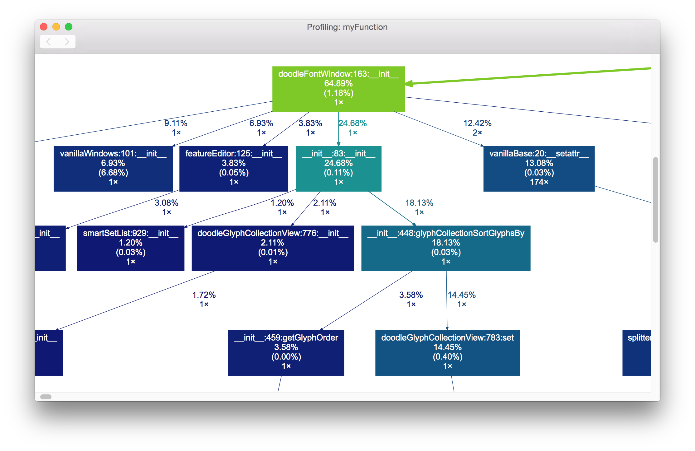

# Profile

Profile and show an overview of what happens under the hood.

Profile is using [gprof2dot](https://github.com/jrfonseca/gprof2dot) by Jose Fonseca.

Required to have some visuale output is [dot](http://www.graphviz.org/download/). 
Install dot/graphviz with `pip install graphviz`

### Example

	from roboFontProfile import ShowProfile
	
	def myFunction():
		NewFont()
	
	ShowProfile(myFunction)

